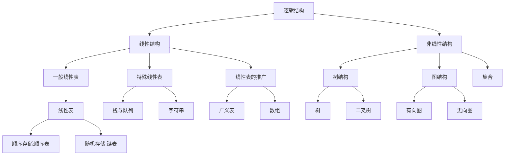
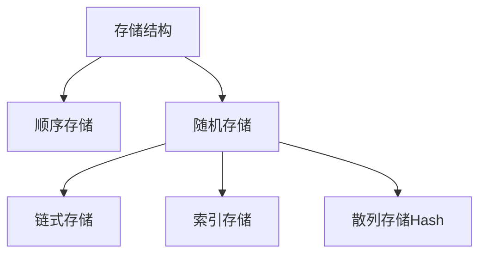



<!-- timeline 04-01 -->
DS第一章节绪论部分。
<!-- endtimeline -->

<!-- timeline 04-02 -->
DS第一章节绪论部分。
<!-- endtimeline -->




[toc]


# DS再复习

# 第一章

## 绪论部分的基本概念

- 数据：一个很宽泛的概念 他是数据元素的集合
- 数据元素：组成数据的基本元素。通常作为一个整体考虑。用来表示一个对象，例如学生数据中 的一条学生信息（包含id，姓名……）
- 数据项：组成数据元素的最小不可分割单元。不可分割是逻辑意义上的，例如上述学生数据中的基本组成就是 id 姓名…… 这些单独拿出来就是一个数据项。
- 数据对象：数据的一个子集，由多个数据元素组成。是具有相同性质的数据元素的集合（这里的相同性质的解释如下：例如整数集合，也就是组成该数据对象的数据元素都是整数；或者混合类型：例如上述的学生信息表，但是组成整个数据对象的数据元素的“类型”都是一样的）
- 数据类型：一个值的==集合==以及定义在这个集合上的==一系列操作==。
- 数据结构：相互之间存在==一种或多种关系的数据元素的集合== 数据的“结构”就是这里的数据元素之间的关系。
  - 逻辑结构：从逻辑关系上描述数据，是从具体问题中抽象出来的数学模型。  通常有四类：集合、线性、树、图结构


<!-- tab -->


graph TD
逻辑结构-->线性结构
逻辑结构-->非线性结构
线性结构-->一般线性表
线性结构-->特殊线性表
线性结构-->线性表的推广
非线性结构-->树结构
非线性结构-->图结构
非线性结构-->集合
树结构-->树
树结构-->二叉树
图结构-->有向图
图结构-->无向图
一般线性表-->线性表
线性表-->顺序存储:顺序表
线性表-->随机存储:链表

特殊线性表-->栈与队列
特殊线性表-->字符串
线性表的推广-->广义表
线性表的推广-->数组


<!-- endtab -->

<!-- tab -->

markdown mermaid 代码部分



<!-- endtab -->


- 物理结构:  ==数据对象==在计算机中的==存储表示==。（）
  - 通常有两种结构：顺序存储和链式存储。（严书第二版只提到两种存储结构，其实是四种。）



<!-- tab -->


graph TD

存储结构-->顺序存储
存储结构-->随机存储
随机存储-->链式存储
随机存储-->索引存储
随机存储-->散列存储Hash



<!-- endtab -->

<!-- tab -->



<!-- endtab -->


一个表示 数据、数据元素、数据项、数据对象之间的关系的图：


### 存储结构\存取结构

- 存取结构
  - 随机存取, 重点在"取"上,指访问指定单元的速度与其位置无关,
  - 非随机存取(顺序存取): 取第i个位置上的元素必须遍历前面的i-1个元素,  链表
- 存储结构,如上 四种
  - 顺序存储:  指的是计算机开辟一个连续的空间来存储他们.重点在于物理上的存储空间的"开辟".
  - 随机存储: 不是开辟一段连续的物理空间.
    - 索引存储
    - 散列存储
    - 链式存储

存取结构描述的是啥?

存储结构是数据结构中的一个重要的组成


## 算法和算法分析 

### 算法的定义和要求

定义：是为了解决某一问题而设计的一系列的（有穷）有限长度的操作（步骤）序列。

一个合格的算法应该具备下列的性质：

- 有穷性
- 确定性：算法过程中遇到的所有情况都有特定的解决方案，==不会产生二义性==
- 可行性：可以由已经定义的所有基本操作实现。
- 输入：有0个或者多个输入。
- 输出：有一个或者多个输出。

### 评价算法的指标

- 可读性
- 高效性
- 健壮性
- 正确性

### 时间复杂度和空间复杂度

- 问题规模：算法输入量的大小，输入规模的大小
- 语句频度：一条语句执行的次数

算法的效率分析并不是单纯的计算程序从编译到执行所用的所有时间，而是计算程序中所有的语句频度之和而得出的一个估计。

因而一个算法的执行时间可以用该算法内部所有的语句频度之和来表示。

#### 时间复杂度

衡量一个算法的时间复杂度用其基本语句的执行频度。（基本语句：指的是其在算法中执行次数与算法的运行时间成正比的语句）从而得出算法的运行时间的函数$$f(n)$$ 而程序的时间复杂度记为$$T(n) = O(f(n))$$ 其定义是:
$$
T(n)和f(n)都是定义在正整数上的函数，则T(n) = O(f(n))的含义是，存在正整数C \ 当 \ n\ge n_{0} \ 时0 \ \le T(n) \le Cf(n)
$$
故O的含义是当输入规模趋近于无穷的时候问题的执行时间的上限不会超过$$f(n)$$ （定义了算法执行时间的上限）。

- 最好时间复杂度、最坏时间复杂度、平均时间复杂度。

这个和概率相关。后面的实例会遇到。

### 普通循环结构的时间复杂度的分析

```
for(int i = 0;i<n;++i){
	operate();
}
```

## 第一章小结

- 弄清楚考察重点在哪：时间复杂度和空间复杂度的估计。
  - 递归函数的时间复杂度计算。
  - 某些特定算法的时间复杂度  例如 2013年的题目：
- 构建起对后面将要学习的内容的一个框架。

### 2013年计算时间复杂度的题目个人理解

需要用到时间复杂度的[定义](####时间复杂度)，可以粗略计算出当前的相对准确的语句频度，然后在选项中找到其乘以一个系数一定大于这个频度的$$f(x)$$

2013统考的这道题目的正确解法：

先想出最坏的情况：连续上升元素交替出现在两个链表中。故最坏的频度是m+n 又$$2max(m,n) \ge m+n$$ 所以根据时间复杂度的定义
$$
T(n) = O(f(x)) \rightarrow \ 0 \le T(n) \le Cf(x)
$$
只有答案 $$O(max(m,n))$$ 符合定义。

时间复杂度的计算中三次连续的求和的最终值为$$T(n)=O\left(\sum_{i=1}^n \sum_{j=1}^i \sum_{k=1}^j 1\right)=O\left(\frac{1}{6} n^3\right)=O\left(n^3\right) 。$$


# 线性表

个人感觉，这一章没啥好讲的，线性表的存储。重点在于最后的线性表的应用相关的算法。

## 线性表的定义[^1]

由n个数据特性相同的元素构成的有限序列称为线性表；n为其线性表的长度。

一个非空的线性表或者线性结构具有以下特点：

- 存在唯一一个头
- 存在唯一一个尾
- 除尾元素外，每个元素都有一个直接后继
- 除头元素外，每个元素都有一个直接前驱。

## 线性表的顺序存储表示（也称作：顺序表）

特点：逻辑上相邻的数据元素其物理次序也是相邻的。

## 线性表的链式存储表示(链表)

### 单链表

- 头插
- 尾插
- 插入
- 删除

### 双链表

### 循环链表

判空条件

### 双循环链表

判空条件


# 王道课后习题速查

## 第二章线性表

### 2.1 线性表的定义和基本操作

1. c
2. b
3. a 

### 2.2  线性表的顺序表示

1. A   (D 存疑)

2. A   (存储结构.)

3. B

4. ==B  --正解- >D==  :存取操作--插入删除操作

   > 随机存取\顺序存取   顺序存储\随机存储(上面有介绍)
   >
   > 本题的重点在于存取操作,而不是插入删除操作.  需要明确对于顺序表来说,插入&删除操作所需要的时间复杂度高.

5. A

6. C

7. C

8. C

9. C

10. B

11. D

### 2.3线性表的链式表示


# 学习过程中发现模糊的点

## 程序从编译到执行的过程。

# 计组中的边界对齐


[^1]: 数据结构 C语言版 （第二版）（严蔚敏、李冬梅、吴伟民）
